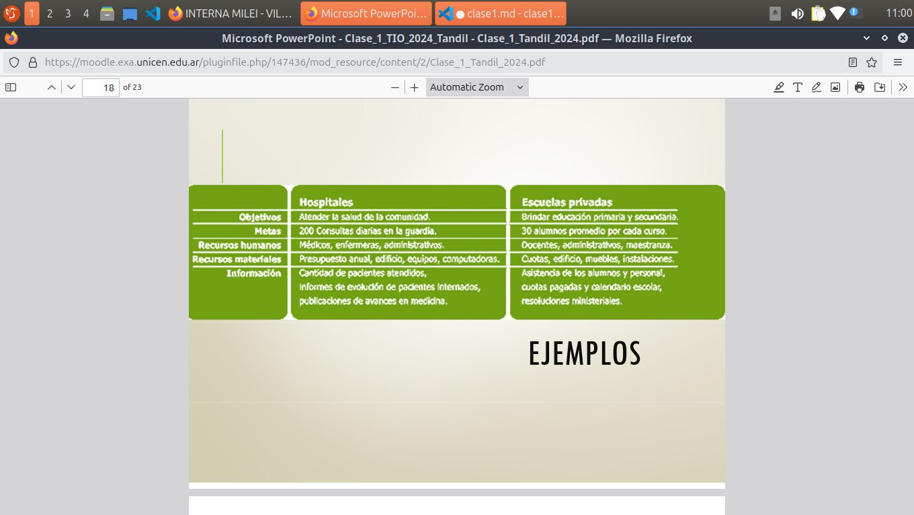

- comisiones practicas: 
    - Comisión 1 Lunes15hs aula 1 pab1
    -  Comisión 2 Lunes 18hs aula 7 pab3

- clases:
    - Asincronicas

### Promocion:
- Nota de parcial >=6(primera instancia)
- • Trabajo práctico especial promocionado
- • SIN FINAL (NO se tienen que inscribir, ya sale el acta de promoción)

### COntenidos generales:
- Tecnologías de la Información
-  Organizaciones y Empresas
-  Colaboración.
-  Sistemas colaborativos para el
- desarrollo de software
-  Sistemas de Información
-  Metodologías de desarrollo y creación
- de sistemas
-  Sistemas de apoyo a la toma de
- decisiones
-  Seguridad de la Información

## Tecnología
Es la aplicacion de un conjunto de conocimientos y habilidades con un claro objetivo: conseguir una solucion que permita al ser humano resolver un problema o satisfacer una necesidad en un ámbito concreto.

### Informacion:
La informacion esta constuitida por un grupo de datos ya supervisados y ordenados, que sirven para construir un mensaje basado en cierto fenomeno. El aprovechamiento racional de la informacion nos permite tomar desiciones.

### Organizacion:
Es un *sistema* diseñado para alcanzar ciertas metas y objetivos. A su vez pueden estar conformados por otros subsitemas que relacionados que cumplen otras funciones.

Estos objetivos se cumplen entre la interaccion de estas organizaciones (un grupo social que agrupa: personas, tareas y administracion) en el marco de una esrtuctura sistematica.

- Es un sistema social porque está constituida por un conjunto de personas cuyas actividades se relacionan entre sí para lograr objetivos.

Elementos que caracterizan a las organizaciones:

- **Objetivos**: son los fines hacia los cuales se encamina la actividad de la organizacion.

- **metas**: las metas son fines especificos, expresados en forma cuantitativa.

- **Recursos humanos**: son las personas que trabajan en la organizacion y se relacionan entre si, aportando su esfuerzo fisico e intelectual, así como sus valores ideas y conocimiento.

***Recursos materiales***: son los medios que utiliza la organizacion para alcanzar los fines propuestos.

- Recursos Físicos: materia primas, maquinarias, herramientas, vehículos, computadoras, etc.

- Medios naturales: los combustibles y la energia

- Recursos funancieros: el dinero, los prestamos, las acciones, títulos, bonos, etc.

***Informacion***: son los recursos *que genera la mente humana* apoyadas o no por el uso de la tecnología.
En las organizaciones hay ***Sinergia***, entre todos los sectores que trabajan juntos, y tambien hay una ***cultura***, que define y sostiene los objetivos comunes que se buscan alcanzar.

;

## Clasificación de las organizaciones:

### Finalidad
- Con fin de lucro (empresas)
- Sin fin de lucro (ONGs)
- Con fines administrativos, representativos, de resolucion o servicios (organismos gurbanamentales)

### Formalidad
- formales o informales

### grado de centralizacinon
- Centralizados o Descentralizados

LOCALIZACION
• Públicas
• Privadas
PROPIEDADPROPIEDAD
• Horizontales
• Vertical

cultura -> 

Los valores: son las creencias o convicciones del grupo
de personas que forman la organización. Por ej: la
responsabilidad, la honestidad.
 Las visiones: son las ideas que los líderes tienen sobre
su futuro, qué negocios seguirán, cuáles crecerán o
cuáles se eliminarán.
 Los impulsores: son las frases que conceptúan la visión
de los lideres y que los miembros de la organización
adoptan, creen y con las que trabajan.

PARA RECORDAR!
Una organización es un grupo social formado por
personas, tareas y administración, que interactúan
en el marco de una estructura sistemática para
cumplir con sus objetivos.
La organización tiene objetivos, metas, recursos
humanos, recursos materiales e información.
La organización como sistema es MAYOR que la
simple sumatoria de los individuos que la
componen(SINERGIA).
La cultura que comparten le da entidad propia y,
a su vez, esa cultura define y sostiene los objetivos
comunes que busca alcanzar