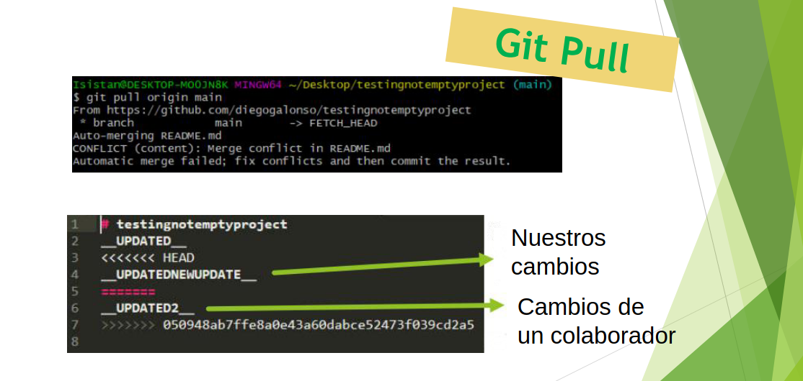
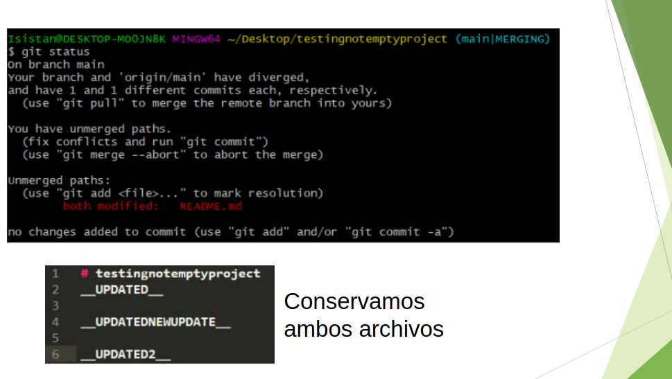
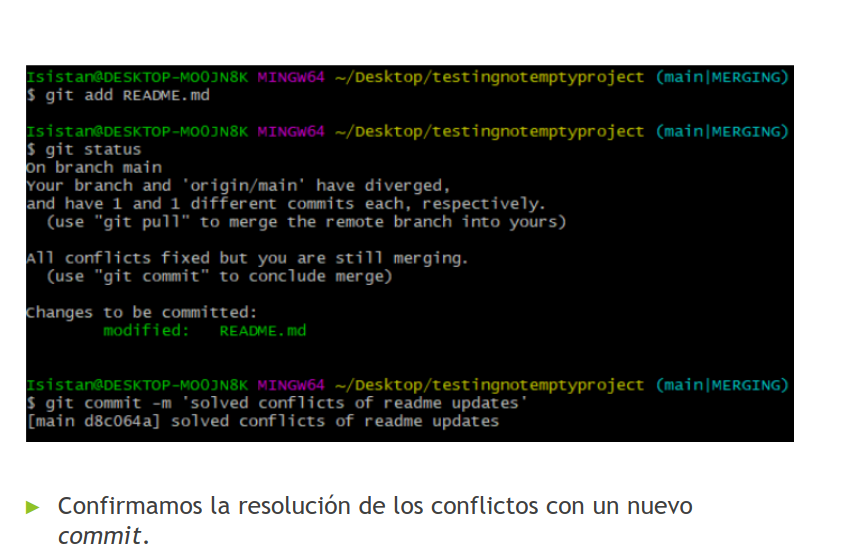
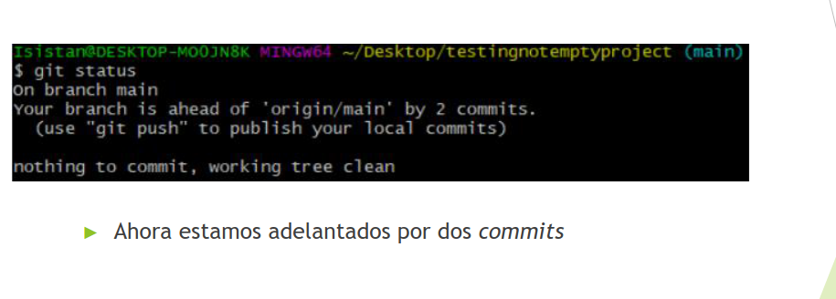
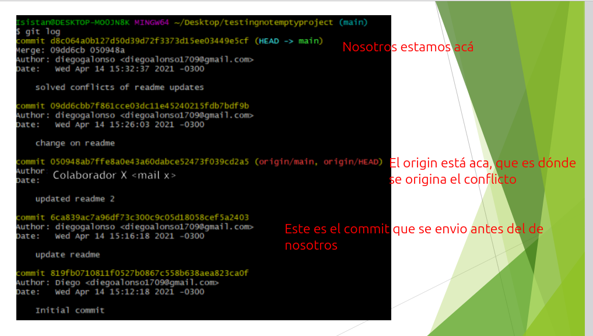
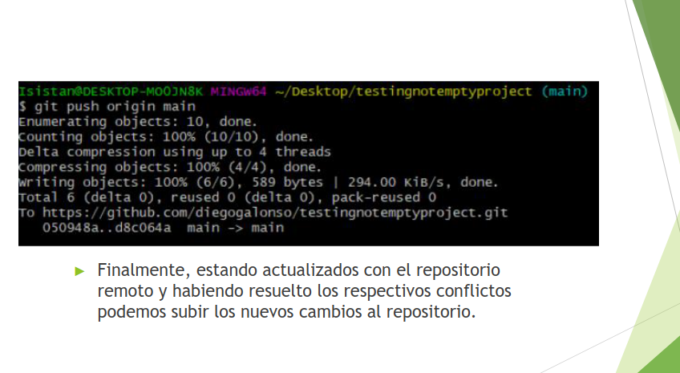

## Repaso

### Flujo de trabajo:

Cuando inicializamos un repositorio, este pasa a tener 3 "estados" o areas, el repositorio en sí, sin nigún cambio, el directorio de trabajo, que es cuando empzamos a trabajr con los archivos, una vez preparamos los cambios, entramos al "estado" de *Área de preparacion* que es un paso medio entre estar en el directorio de trabajo y el repositorio sin cambios. Una vez etamos seguros de hacer los cambios porque ya termiamos, confirmamos los cambios y el repositorio queda en el estado inicial, esperando a que se realice algun cambio en el archivo para volver a repetir el ciclo, este estado es como si fuese el inicial, en el que toma los cambios confirmados de los archivos como si fuese el valor originales digamos. Es el estado de los archivos lo que define el estado del repositorio, al inicial vamos a decirle "en reposo", que es cuando o bien lo inicializamos y no hay archivos todavia, o toma como valor inicial los archivos que ya estan, o bien cuando los cambios en los arhivos estan confirmados. El más minimo cambio mueve al repositorio al estado de "Directorio de trabajo".

### Ciclo de vida de los archivos:
Los archivos tienen 4 estados: "Sin seguimiento", "Sin modificacion", "modificado", "preparado".

Cuando agregamos un archivo, (con git add) este pasa de no tener seguimiento a estar preparado de una. Sin seguimiento es sólo cuando el archivo es nuevo y vuelva a estar sin seguimiento si lo eliminamos, generalmente se va a mever en los otros tres estados.

Una vez preparado, si confirmamos el archivo (con git commit) este pasa a estar "Sin modificacion",  si lo editamos, pasa a estar "Modificado". Si lo preparamos (tambien con git add) pasa a estar "Preparado".

### Comandos

- Revisar estado de un/los archivo/s
    - `git status`
- Agregar archivos a seguimiento o a staged area (area de preparacion)
    - git add [nombre_del_archivo]
    - git add .
- Confirmar los cambios
    - git commit -m "mensaje de confirmacion"
- Ver historial de confirmaciones
    - git log

## Repositorios remotos

Son versiones del proyecto que están hospedados en Internet.
Tenemos varios repositorios remotos ya que que nos permite tener:
- Backup
- Versiones estables accesibles por terceros
- Repositorios de test

Github es el servidor más famoso y utlizado.

[ Creamos un repositorio en github para probar ]

Una vez creado el repositorio remoto tenemos dos opciones:
- Subir las confirmaciones registradas en nuestro repositorio local
- Clonar el repositorio remoto y comenzar a trabajar localmente desde este punto

### Configurar repositorio remoto

- Comando `git remote`
    - Nos permite administrar y configurar nuestros repositorios remotos
    - `git remote` nos mostrará los repositorios remotos que tenemos configurados en nuestro repositorio actual
- Si queremos subir nuestras confirmaciones al repositorio remoto primero debemos configurarlo
    - `git remote add origin https://github.com/user/repo.git`
    - *origin* será el nombre que utilizaremos de aquí en adelante para referirnos a dicho repositorio remoto.
    - *origin* es el nombre que Git le da por defecto al repositorio remoto del que clonamos.
    - `git remote -v` nos listará los nombres de los repositorios remotos y sus enlances.

### configurar una rama local:
Alternativas:
- subiendo las confirmaciones
    - `git push -u origin main`
    - `git push --set-upstream origin main`

- Sin subir las confirmaciones 
    - git branch -u origin/main
    - git branch --set-upstream-to=origin/main

## Agregar colaboradores:

1. Vamos a settings

2. Vamos a "Manage Acces"
3. Invite a collaborator

Podemos buscar por username, o email.

## Conflictos

Un conflicto se dá cuando alguien realiza cambios antes que nosotros (nos pide que primero integremos los cambios de ese push)

### Git pull

`git pull origin main`

Entonces lo que pasó acá fue lo siguiente: Nosotros hicimos una modificacio sobre Readme.md, y cuando la commiteamos nos surgio un conflicto, porque habia otro commit sobre ese mismo archivo, que nosotros nunca habiamos actualizado, por lo que nosotros teniamos el original, y queriamos cambiar el ya modificado. Por lo que tuvimos que hacer un git pull para traer dicha actualizacion, y tener ambos cambios, el propio y el del colaborador.

Ahora hacemos un `add Readme.md`. Y luego pedimos el estado de los archivos. Este nos dice que nuestra rama y la rama de origin/main han sido "diverged" y tienen 1 comic diferente cada una. Ahora commiteamos con el mensaje "solved conflicts on readme updates".

Y si vemos el status ahora nos dice que estamos adelantados por dos commits, y que usemos push para publicar nuestros commits.

Esos dos commits son: "*change on readme*", el que origino el conflicto, y por ultimo "*solved conflicts of readme updates*". Y estamos adelantados porque el último commit de la rama remota fue el del colaborador,  antes de que hagamos el commit que inicia el conflicto. Y ahora si podemos subir los nuevos cambios al repositorio remoto.

Ver repositorios remotos configurados
► git remote
► Añadir repositorio remoto
► git remote add [nombre] [url]
► Clonar repositorio remoto
► git clone [url]
► Remover repositorio remoto
► git remote rm [nombre]
► Ver ramas existentes en el repositorio
► git branch
► Subir confirmaciones a repositorio remoto
► git push [nombre-remoto] [rama]
► Actualizar de repositorio remoto
► git pull [nombre-remoto] [rama]

## Bibliografia

Leer:
2.5 – 2.6 Fundamentos de Git

[practicar](https://learngitbranching.js.org/?locale=es_AR)
Y fijarse bien que hacía el clone a diferencia del add.

