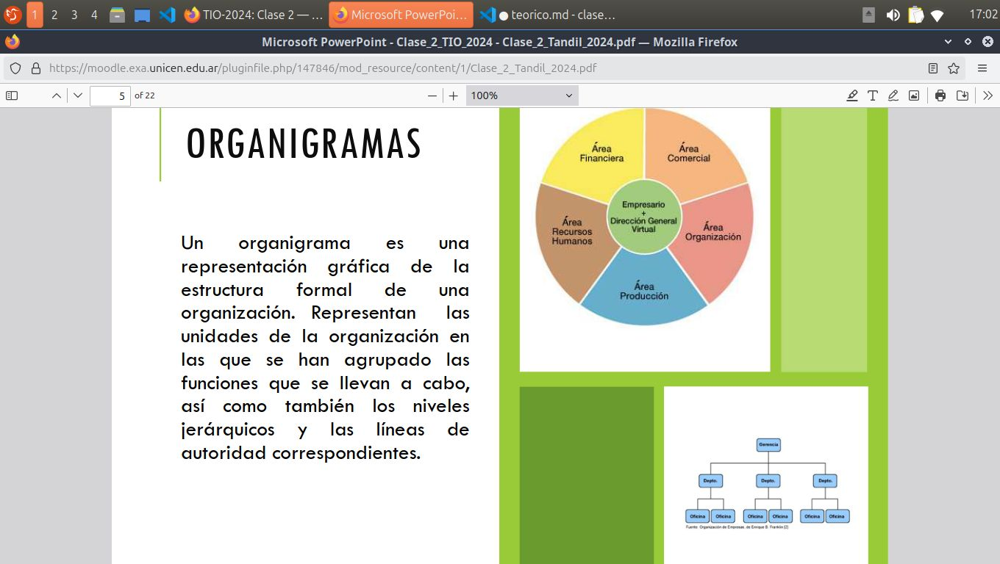

## Piramide Organizacional:

Consta de tres niveles, el superior, que determina los objetivos a largo plazo y proyecta las politicas y estrategias.

Nivel medio o táctico: coordinan las actividades que se desarrolan en el nivel operativo, así como las desiciones que se toman y que afectan a un sector o area determinada.

Nivel operatico (o inferioir): Son quienes realizan en forma eficaz las tareas que se realizan en la organización. Estas están previamente programadas por el nivel medio.  

miembros: 

- nivel superior: presidente, directorio, gerente general, etcétera.
- nivel medio: gerentes de produccion, administracion de ventas, ...
- Nivel inferioir: empleados administrativos, obreros, operarios, ...

Las organizaciones se estructuran sobre la base de dos divisiones del trabajo:

- Horizontal: es la que se refiere a particionar el trabajo en tareas, por ejemplo, ventas, compras, finanzas, etc.

- Vertical: se refiere a la división del poder o de las tareas de desición. Se conoce como piramide organizacional.

### Organigramas 
Son una representacion gráfica de la estructura formal de una organización en las que se han agrupado las funciones que se llevan a cabo, así como también los niveles jerárquicos y las lineas de autoridad correspondientes.

- permiten conocer la estructura de la organizacion
- Cada persona que trabaja en ella puede tener clara visión de la posición de su rol dentro del conjuto y de sus posibilidades de ascenso. 
- Se pueden detectar fallas: como que un cargo dependa de más de dos personas, que a alguien se le haya delegado la seupervicion de un numero excesivo de personal etc.

La empresa es una organizacion que desarrolla actividades economicas, y reúne los servicios de los factores de
producción (recursos, trabajo y capital). Como producir/comercializar bienes o servicios. Por lo que esuna organizacion con fines de lucro. Como organizacion, cuenta con: objetivos, metas, recursos humanos, recursos materiales e información.

## Empresa:

- agrupa distintas unidades en la que se subdivide la misma .
Para diseñar una estructura de empresa debemos considerar los siguientes factores:

- que todas las funciones se encuentran cubiertas para cumplir objetivos. 
- que cada unidad esté en condiciones dea cumplir con las funciones asociadas.
- que esta asignacion de tareas busquen la eficiencia
- que las tareas homogeneas sean asignadas a la misma unidad, a los efectos de obtener economías por especializacion.

### Funciones de la empresa:

- produccion: supone tanto el aprovisionamiento de los factores productivos (materias primas, mercancías, servicios externos, etcétera) como su posterior transformación en bienes y servicios capaces de satisfacer lsa necesidades. 
- comercializacion: una vez producido eñ producto, este debe comercializarse y distribuirse. Se conoce como marketing, y busca  tambien para posicionarse sobre la competencia.
- recursos humanos: organiza y gestiona el personal de la empresa. Contrata, forma y motiva a los empleados.
- Financiacion: a través de esta función, la empresa capta los fondos necesarios para el funcionamiento de la empresa y realiza las inversiones necesarias.
- Administración: se refiere a la organizacion de la empresa en su conjunto, es decir, se encarga de repartir tareas y niveles jerarquicos.
- I+D+I (investigacion, desarrollo, innovación): u objetivo de mejorar los procesos productivos, pero también se incluye en esta función cualquier innovación en el resto de las funciones que suponga una mejora de la empres 

## Empresas tecnologicas: 
Son un nuevo tipo de empresas, las cuales se basan en el uso intensivo del conocimiento científico y técnico para mantener su competitividad

- cuentan con personal cienteifico o tecnico cualificado con formacion superior
- Produce bienes y servicios con alto valor añadido
- Gran capacidad de innovacion 
- capacidad de aprendizaje

faltan las dos ultimas paginas

El organigrama muestra la división deltrabajo en tareas y las jerarquías o nivelesde autoridad/decisión.
La empresa es una organización, por lotanto tiene: objetivos, metas, recursoshumanos, recursos materiales e información.
Las funciones de la empresa son:producción, comercialización, recursoshumanos, administración, IDI
Empresas de base tecnológica: I&D, usointensivo del conocimiento, innovación, derápido crecimiento y adaptación a loscambios