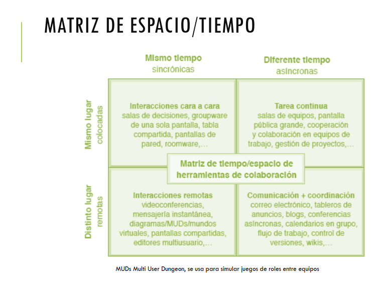
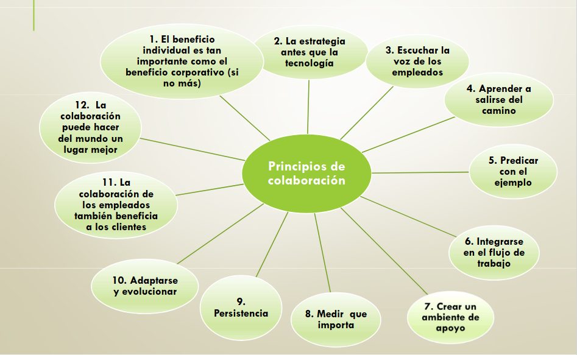
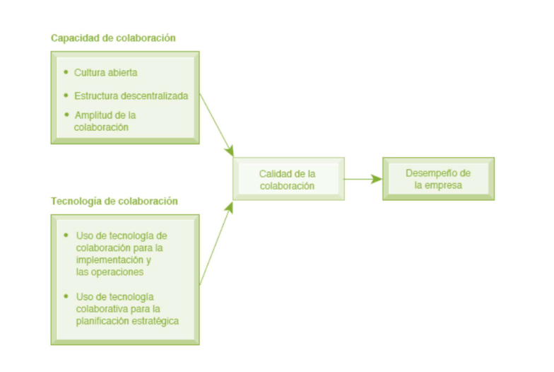
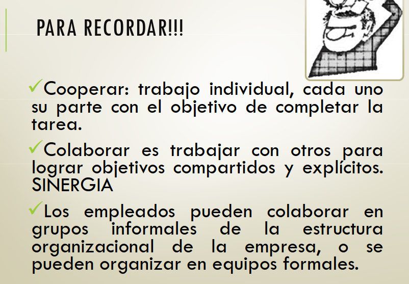

## Cooperacion o colaboracion

Es trabajar con otros para lograr objetivos compartidos y explicitos. Se enfoca en realizar tareas o misiones y por lo general se lleva a cabo en una empresa u otro tipo de organizaciones y entre una empresa y otra.

La *colaboración* puede ser de corto plazo, en don dura unos cuantos minutos. O de un plazo más largo dependiendo de la naturaleza de la tarea y de la relación entre los participantes.

La colaboración puede ser de uno a uno o de varios a varios.

Los empleados pueden colaborar en grupos informales de la estructura organizacional de la empresa, o se pueden organizar en equipos formales.

El trabajo en equipo es parte de la estructura de negocios de la organizacion para realizar tareas.

Los **equipos** tienen una misión especifica que alguien en la empresa les asignó.

## Colaboración

### Beneficios de la colaboracion para la organizacion:

- Productividad

     Las personas que trabajan juntas pueden completar una tarea compleja con más rapidez que el mismo número de personas que trabajan aisladas. Habrá menos errores.

- Calidad:

    Las personas que trabajan juntas y colaboran pueden comunicar los errores y corregir las acciones con más rápidez que cuando trabajan aísladas. Esto puede conducir a una reduccion de los buferes y del retardo de tiempo entre las unidades de produccion.
- Innovación

    Las personas que trabajan y colaboran en grupos pueden producir más ideas innovadoras para productos, servicios y administración que el mismo número de personas que trabajan de manera aísladas.
- Servicio al clliente:
    
    Las personas que trabajan juntas en equipos pueden resolver las quejas y los problemas de los clientes con más rapidez y efectividad que si estuvieran trabajando aisladas.
- Desempeño financiero (rentabilidad, ventas y crecimiento de las ventas):
    
    Como resultado de todo lo anterior, las empresas colaboraivas tienen un crecimiento superior en las ventas y en el desempeño financiero.

### Requerimientos para la colaboracion

### Herramientas colaborativas:
- Son los sistemas que permiten acceder a ciertos servicios que facilitan a los usuarios comunicarse y trabajar conjuntamente sin importar que estén reunidos en un mismo lugar.
- Se pueden compartir informacion en determinados formatos multimedia, y en algunos casos producirlos conjuntamente.
- Algunas aplicaciones proveen de avanzadas funcionalidades que facilitan tareas como publicación de información, búsquedas, filtros, acceso, privilegios, etc.

