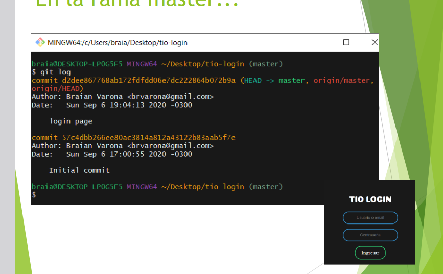

## ¿Qué es una rama?

#### Head

- `head` Es el commit dónde nos encontramos actualmente.

- Una rama es una *linea de tiempo* de nuestro proyecto.
- Se compone de una *secuencia de commits*.
- Se utilizan para desarrollar nueva funcionalidad, corregir errores, realizar pruebas, etc.

#### Git permite múltiples ramas

## Operaciones básicas:

### Listar las ramas locales:

`git branch`

- El simbolo `*` indica la rama a la que apunta el `HEAD`

### Crear rama local

`git branch <NAME>`

- Creamos la rama, pero `HEAD` sigue apuntando a `master`.

### Cambiar de rama:

`git checkout <NAME>`

- Si usamos `git checkout -b <NAME>`, además de crear la rama nos posicionamos sobre ella.

### Eliminar la rama:

`git branch -d <NAME>`

- Una rama puede ser borrada si todos sus commits han sido "absorbidos".
- Para forzar un borrado usamos la flag `-D`.

## [Ejemplo practico](https://github.com/exa-tio/ejemplo-login)

En el ejemplo, se nos pide realizar cambios a una pantalla de login. Estas son las tareas que nos asignan:

1. Realizar cambios de color en el título y en el background.
2. Cambiar texto boton a mayusculas.

Realizamos los cambios en la rama "`estilos`".

- ¿Qué sucede si cambiamos a la rama master con el comando git checkout?
  - que dice el git log?

#### Fucionar dos ramas

### Fast forward:
- La fusion se realiza de manera automatica
- No hay conflicto entre una rama y otra (los commits fueron de manera secuencial)
- Se pudo "unir" todo el contenido sin problemas.

¿Que pasaria si otro/s programador/es hubieran hecho otros commits en la rama principal (en este caso `master`).

#### Manual merge

El programador es quien debe resolver el conflicto

Para salir de este estado de "*Merging*" es necesario resolver el conflicto, agregar los archivos al staging area y luego realizar la confirmación. 

> pensemos que son dos cambios apuntando a la misma linea de código en este ejemplo.

#### Confirmación del merge

- Para salir del estado de "merging" es necesario resolver el conflicto, agregar los archivos a la staging area y luego realizar la confrimacion.

### Ramas remotas:

 - `git push -u origin <remote> <remote_branch>`
 - `git push -u origin <remote> <local_branch>:<remote_branch>`

Ejemplo:

`git push -u origin estilos`

#### ¿Por qué hacer *branches* en el proyecto?

- Para desarrollar software en paralelo e independientemente entre los programadores.
- Para mantener varias versiones del proyecto.
- Para no afectar al código principal.
- Para disminuir errores.

## Resumen:

- `git branch`: lista las ramas locales.
- `git branch <rama>`: crea una nueva rama.
- `git checkout <rama>`: cambia el puntero de HEAD a <rama>.
- `git checkout -b <rama>`: crea la rama y hace que HEAD apunte a ella.
- `git branch -d <rama>`: elimina la rama.
- `git merge <rama>`: fusiona el contenido de la <rama> en la rama dónde estamos parados.
## Bibliografia

[Git book 3.3](https://www.atlassian.com/git/tutorials/using-branches)