## Habilidades blandas

Las habilidades blandas (o soft skills) se refieren a un amplio conjunto de competencias, comportamientos, actitudes y cualidades personales que permiten a las personas navegar eficazmente en su entorno. Trabajar bien con otros, desempeñarse bien y alcanzar sus metas. Estas habilidades son ampliamente aplicables y a su vez complementan otras hábilidades como técnicas vocacionales y acádemicas.

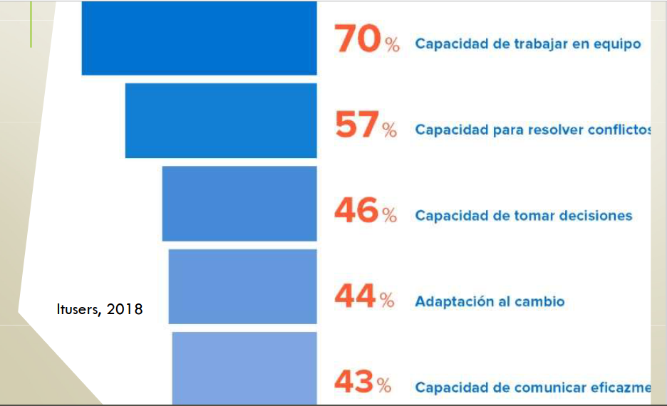
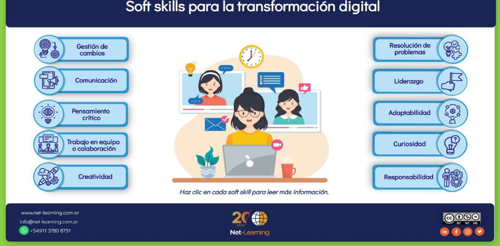

### Habilidades blandas - Comunicacion efectiva:

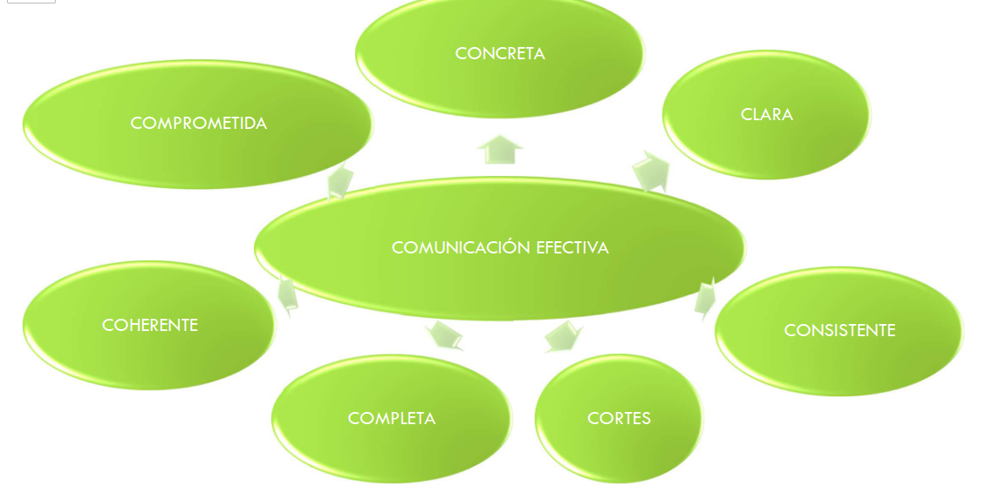

### Equipos de trabajo

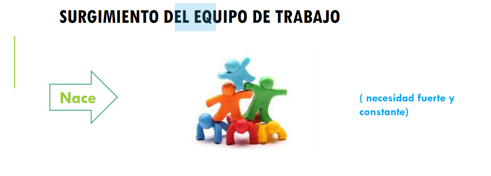

#### Organizaciones
- Necesidad de mejorar algunas condiciones que están interfiriendo en el logro de las metas.
- Cuando se agrupan las personas como un equipo, la rotación disminuye y se realiza un trabajo mucho mejor.
- El trabajo en equipo con frecuencia ocaciona una mejor motivación y un ritmo más rápido de trabajo.

### Trabajo en equipo y grupos de trabajo

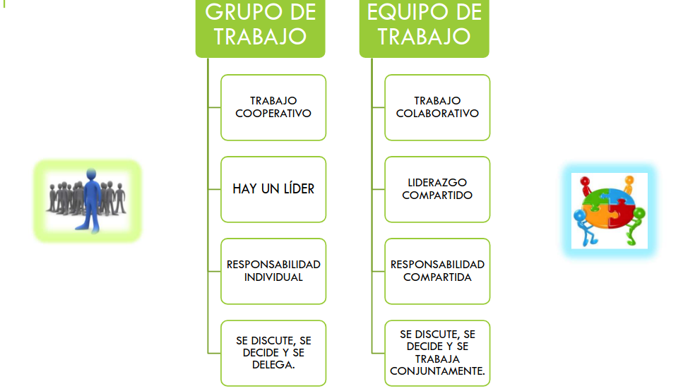

- Trabajar en equipo es una oportunidad de crecimiento personal.
- En ningún caso debe falsear nuestra manera de ser.
- "Conocer" a las demás personas, no estereotipar ni excluir.
- Nos permite pulir las aristas de nuestra personalidad.
- Nos enseña a ser responsabler de nuestros actos antes los demás.

#### Bases del trabajo en equipo
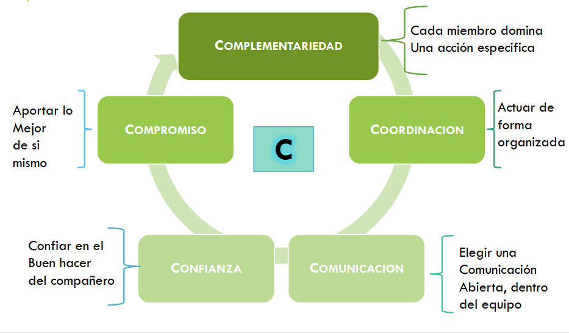

#### Caracterisitcas:

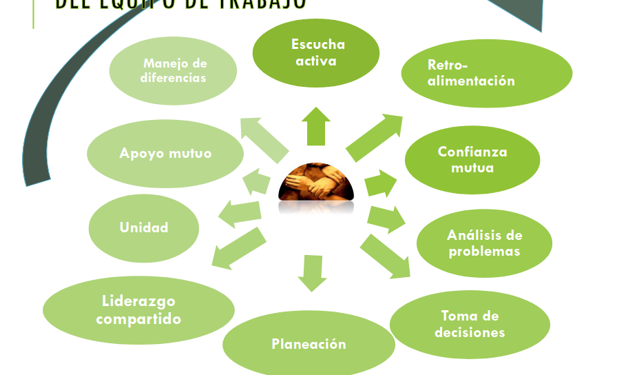

#### Motivacion del equipo
Es clave para el éxito de un equipo

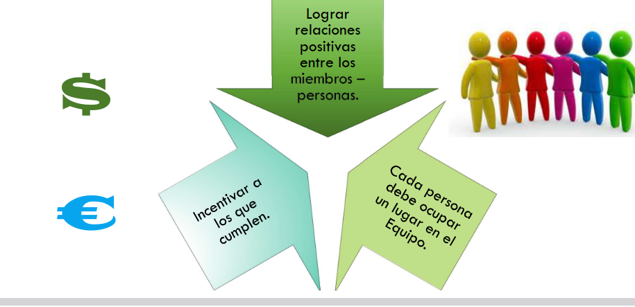

#### Factores que conducen al éxito de un trabajo en equipo

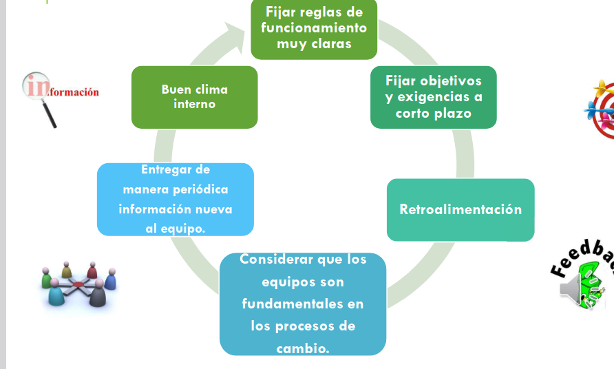

#### Algunas capacidades y habilidades que la gente que trabaja en equipo debe aprender

- Saber escuchar.
- Dar y recibir criticas constructivas.
- Aprender a pedir ayuda.
- Dar y recibir confianza.
- Desarrollar capacidad de empatía.
- Expresar sentimientos.
- Disposición para cambiar de opinión.
- Buscar información y opinienes diferentes.
  
#### Ventajas del trabajo en equipo:
- Oportunidad de aprendizaje mutuo.
- Identidad de las personas con su organización.
- Agiliza planes y programas.
- Permite acciones más asertivas, eficaces, creativas (visión de distintos angulos por los participantes)

#### Toma de desiciones

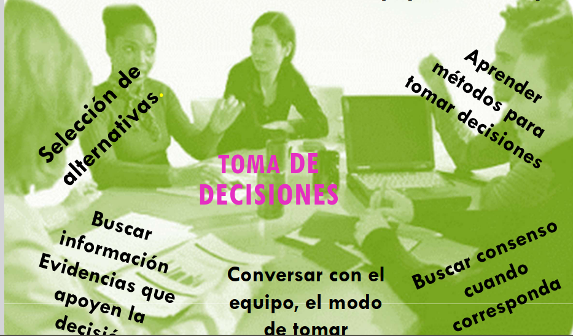

## Conflictos en los equipos de trabajo

Son situaciones de crisis que surgen cuando las inquietudes de dos o más personas parecen incompatibles.

**Areas de conflictos**: Distintas percepciones sobre:

- Los hechos.
- Los métodos.
- Las metas.
- Los valores.
  
#### Efectos de un conflicto:

**Positivos**:

- Aumenta la creatividad.
- Clarifica ideas.
- Se aprende a conocer a los intengrantes.
- Oportunidad para cambiar situaciones molestas.

**Negativos**:
- Dismuniye la productividad.
- Desajuste temportal.
- Tardanza en la toma de desiciones.

#### Que hacer frente a un conflicto

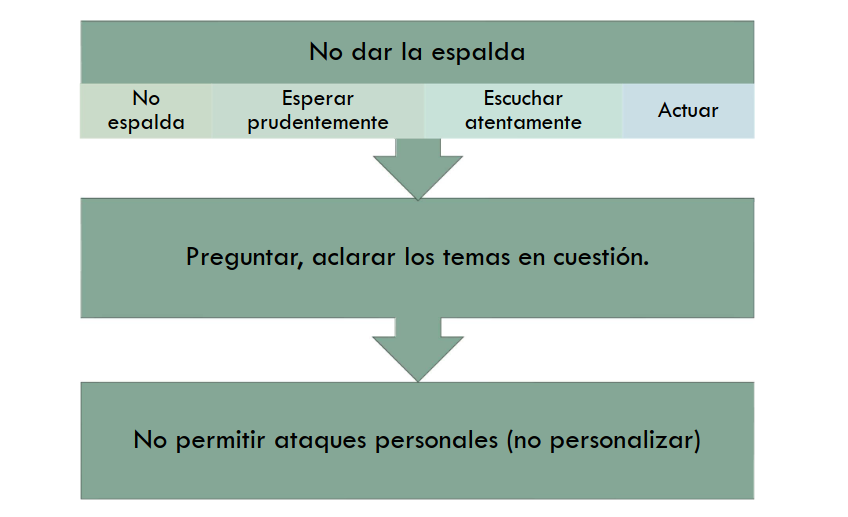
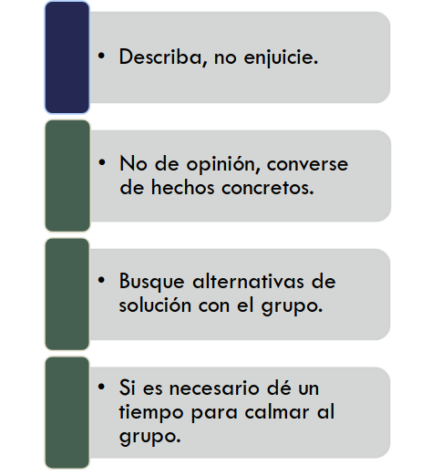

#### ¿Cómo sulucionar los problemas?

Todas las partes deben ponerse de acuerdo. Es de ayuda, si la gente esta de acuerdo en  que existen problemas.
Las personas pueden encontrar que es más facíl hacer frente al conflicto si pueden aceptar que el resultado final de la formación de equipo no es que la gente simpatice con otros sinó que se comprendan unos a otros y sean capaces de trabajar juntos.

## Reuniones de equipo de trabajo

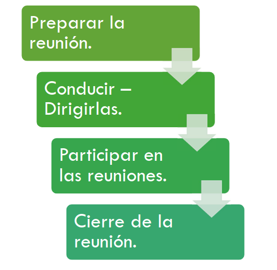

## Para recordar:

- El jefe ordena, el lider motiva.
- Aprender a escuchar a los demás, tener la mente abierta, ser respetuoso en las disidencias, entre otras, ayuda a resolver conflictos.
- Soft skills.
- Comunicación.