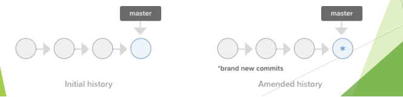
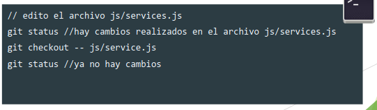
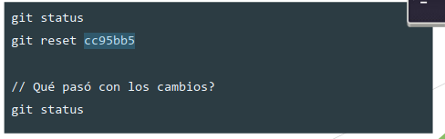
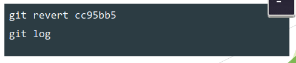
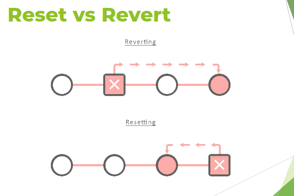
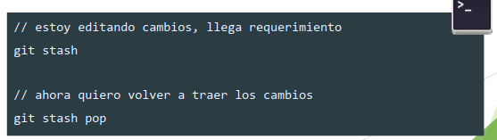
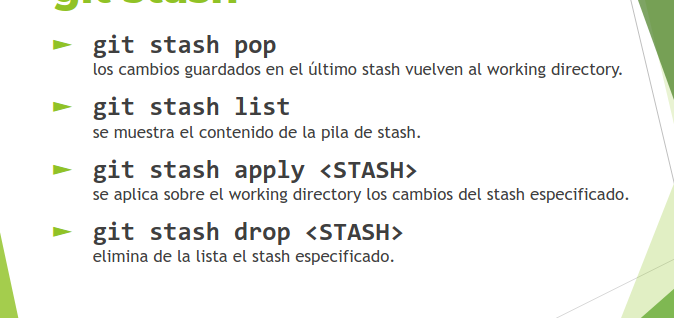

# Deshacer cambios con git

## ¿Cómo modificar mi último commit?

Supongamos que:
1. Hemos modificado y confirmado (commit) nuestros cambios.
2. Pero nos damos cuenta que olvidamos incluir una modificación.

### git commit --amend
- Permite <u>modificar el último commit</u> realizado.
- Se utliza cuando realizamos un commit antes de tiempo y queremos incorporar algún archivo o cambiar el mensaje de confirmación.

- `git commit --amend -m <mensaje>`
- `git commit --amend --no-edit`

> Con git amend modificamos el último commit, esto quiere decir que si por ejemplo nos quedó un archivo sin agregar al último commit, primero hacemos un git add de este archivo, y luego un git amend que lo que haría sería como "rehacer" el último commit pero con los cambios que nosotros incluimos, esto incluye el mensaje.

## como deshacer cambios del working directory

Supongamos que:

1. Modificamos un archivo (o varios) por error.
2. Algunos lo agregamos.

### git checkout --[archivo]
- Permite revertir archivos individuales o repositorios enteros.
- Se utiliza cuando queremos deshacer un cambio realizado sobre un archivo determinado que se encuentra en nuestro working directory. (el archivo modificado)
- `git checkout -- <archivo>`

## Como "movernos en el tiempo" (a otro commit):

Supongamos que:

1. necesitamos ver el estado del repositorio en un determinado momento (por ejemplo *commit cc95bb5*).
2. Queremos movernos sin riesgo de perder cambios.

> Queremos mover el head de un archivo "a un estado atenrior" pero sin deshacer el commit en el que estamos. 

### Git Reset
- Permite *volver a versiones anteriores* y limpiar el repositorio.
- Se utiliza cuando queremos **deshacer un archivo preparado** (git add) o para deshacer commits.
- Los cambios que no estén en el *Stagin Area* seguirán en estado "Modified" a no se que usemos --hard
- Se le puede especificar ***a qué momento*** queremos volver (commit, tag, etc).

> Este comando nos permite sacar un archivo del "Staging area" es decir que se va a incluir en el próximo commit, pero sin perder las modificaciones realizadas hasta el momento.
#### formas de uso:

- `git reset --hard`
  
  Deshace todos los cambios en archivos modificados y preparados.

- `git reset HEAD <archivo>`
  
  Dehace el archivo preparado.

- `git reset HEAD~<N>`
  
  Deshace los últimos n commits manteniendo las modificaciones.

- `git reset HASH` 
  
  se deshaces los commits posteriores al commit especificado.

#### reset: soft vs mixed vs hard

Cada modo, tiene una forma distinta de gestionar los cambios producidos por los commits eliminados:
- git reset --soft
  > Los cambios quedan en el staging area
- git reset --mixed
  > opcion por default, los cambios quedan en el working directory (deben ser agregados)
- git reset --hard
  > Los cambios se descartan por completo

- git reset --soft <commit>:

>    Qué hace: Mueve el puntero del HEAD al commit que especifiques, pero mantiene todos los cambios en el área de staging.
>    Uso típico: Para deshacer commits sin perder los cambios que habías hecho y quizás volver a hacer un commit corregido.

- git reset --mixed <commit> (es el comportamiento por defecto):

>    Qué hace: Mueve el HEAD al commit que especifiques y deshace los commits, sacando los cambios del área de staging, pero manteniéndolos en el directorio de trabajo.
>   Uso típico: Para deshacer commits y volver a preparar los archivos para el próximo commit si se necesita ajustar algo, pero sin perder los cambios.

- git reset --hard <commit>:

>    Qué hace: Mueve el HEAD al commit que especifiques, elimina los commits recientes y los cambios en el directorio de trabajo. Es como si hubieras vuelto a ese commit exacto y todo lo posterior se pierde.
>   Uso típico: Cuando quieres borrar completamente cualquier commit y cambio hecho después de un cierto punto, volviendo tu proyecto a un estado anterior exacto.

Supongamos que tienes tres commits: A -> B -> C y te das cuenta de que no quieres B y C.

>    Con git reset --soft B, eliminas el commit C pero mantienes sus cambios listos para ser añadidos de nuevo si lo deseas.

>    Con git reset --mixed B, eliminas C y B, pero los cambios siguen presentes en el directorio de trabajo.

>    Con git reset --hard B, eliminas C y B, y los cambios asociados se pierden por completo.

## Como deshacer un determinado commit:

Supongamos que:

1. Identificamos que los cambios el commit *cc95bb5* no deberian estar en la version actual del proyecto. Queremos "eliminar ese commit".
2. `Revert` *crea un nuevo commit* que revierte el commit original.
3. Pueden aparece conflictos que tendremos que resolver.
   

### git revert
- Permite revertir el estado del proyecto, generando un nuevo commit que revierte los cambios realizados.
- Los commits no son eliminados del historial de cambios, conservando dicha informacion.
- Es más seguro que un reset.
- `git revert <HASH>`
  

## guardar trabajo en progreso que todavía no vamos a commitear pero tampoco queremos perder:
Supongamos que estamos trabajando en algo pero de repente nos piden que nos ocupemos de otra tarea. Tenemos trabajo sin confirmar en el cual quierriamos seguir trabajando más adelente:

### git stash

- Permite descartar los cambios, pero guardar provisionalmente los archivos modificados.
- Se útiliza cuando se requiere pasar a otra tarea pero sin realizar el commit del trabajo realizado hasta el momento.
- Estos cambios se guardan temporalmente para continuar trabajando en un futuro.
- Funciona como una pila.
- `git stash`
- `git stash save <comentario>`

