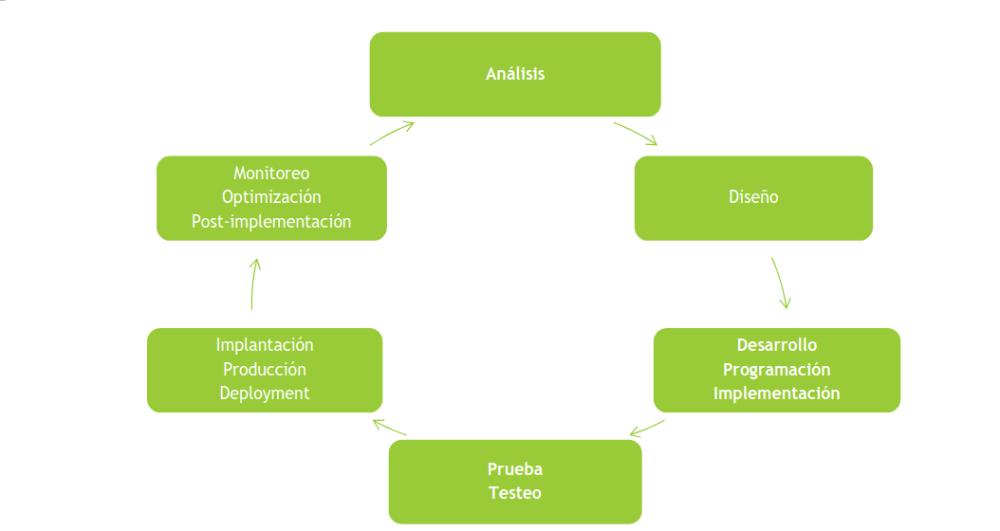
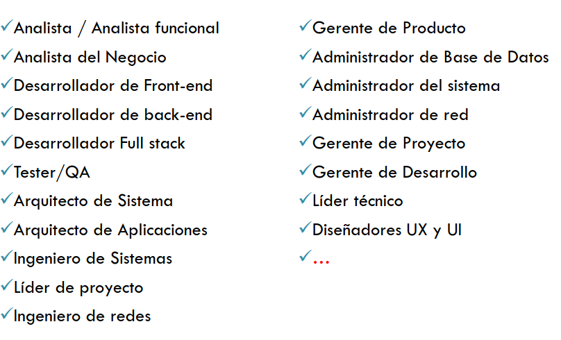
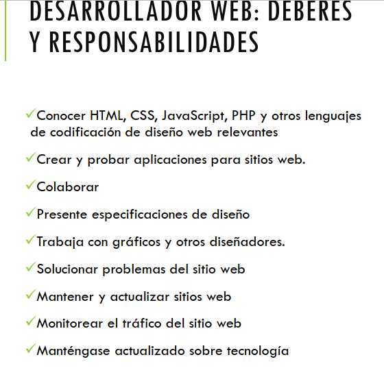
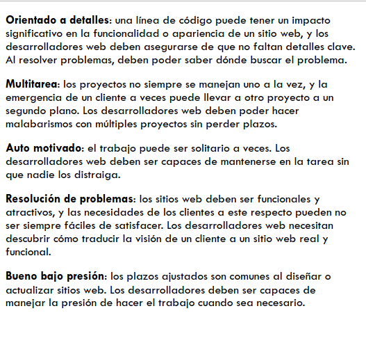
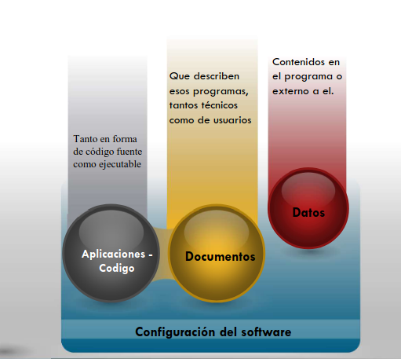
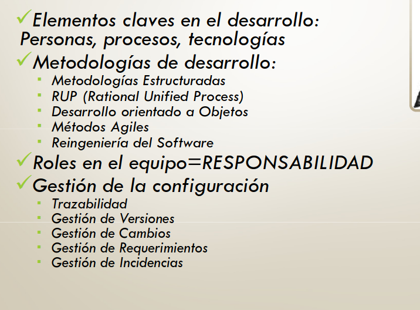

## Ciclo de vida clásisco para el desarrollo de sistemas

- Analiís:

    Definición del problema, identificación de la solución, analisís de factabilidad, estimación de esfuerzo, recursos y duración, identificación de riesgos y especificacion de requerimientos.

- Diseño:
    - nuevo desarrollo: Diseño lógico y Físico.
    - sistema existente: configuración y parametrizacion del sistema.

- Implementacion:
  - Nuevo desarrollo: Codificacion del sistema
  - sistema existente: configuracion y parametrizacion del sistema.

- Prueba: Comprobacion del funcionamiento del sistema.
  - pruebas unitarias.
  - prueba de sistemas
  - prueba de aceptacion de usuario.
  - otra calse de prubeas
  - capacitaciones.
  
- Implantacion: implantar el nuevo sistema.
  - Estatregias posibles.
    - paralela
    - cambio directo
    - estudio piloto
    - por fases
- optimizacion
  - monitoreo del sistema para detectar:
    - Errores
    - Modificaciones
    - Mejoras

## Métodologias para el desarrollo de sistemas

### Metodologias:
Conjunto de métodos que se  utilizan para cubrir las actividades de un proceso determinado.

### Metodologia de desarrollo de sistemas:
Conjunto de métodos que brindan soporte a cada  una de las actividades dentro de las fases de un proyecto de sistemas.

- 1) Metodologias estructuradas
- 2) **R**ational **U**nified **P**roces
- 3) Desarollo orientado a objetos
- 4) Métodos agiles
- 5) Reigieneria de software

   
1. Metodologia estructurada - Técnica más orientada a los procesos que a los datos. Son ***descendentes***: desde el nivel más alto y abstracto hasta el más bajo y detallado. Utilizadas para el enfoque de ciclo de vida más tradicional. Incluyen
    - Analisis estructurado: **DFD**, Especificaciones de Procesos.
    - Diseño estructurado ->    Diagrama de estructura.
    - Programacion estructurada -> Diagrama de flujo de sistemas, estructuras de control (secuencia, seleccion, iteracion) modularizacion.

2. Metodos agiles
    - Proceso de creacion de *sistemas funcionales en tiempo muy corto*.
    - Proceso no secuencial. **Partes clave del desarrollo se realizan en paralelo**.
    - Utilizadas para el enfoque de prototipos y con herramientas de cuarta generación.
    - Colaboración estrecha entre usuarios y especialistas de sistemas.
    - Casi no se genera documentacion.
    - Técnicas utilizables: diseño conjunto de aplicaciones (Joint Application Design, Scrum, XP)

3. RUP - Métodología que divide al proceso en 4 fases:
   1. Inicio
   2. Elaboracion
   3. Construccion
   4. Transicion
   - Utilizable para cualquier tipo de proyectos. Cada fase tiene sus actividades asociadas.
   - Métodología iterativa con desarrollo incremental o en cascada.
   - La documentación se basa en ciertos diagramasy para esto utiliza el UML. Ejmplo:
     - Para el analisís: Caso de uso, Diagramas de estado.
     - Para el diseño: Diagrama de clases, Diagrama de componentes, de comunicaciones, etc.

4. Desarrollo orientado a objetos:  
    - Objeto como unidad báscica que encapsula datos y acciones que se pueden realizar sobre los mismos. Los objetos se relacionan entre sí.
    - Los objetos tienen la misma característica que son reutilizables, se agrupan y utilizan herencia.
    - Utilizado para enfoque hibrido entre ciclo de vida tradicional y prototipos.
    - Desarrollo de framworks -> Reusabilidad.
  
5. Reingenieria de software:
  - Metodología que ataca el problema del envejecimiento del software reciclandolo.
  - Se utiliza la reigieneria para extraer la información de diseño y programación de los sistemas existentes siguiendo los pasos:
    - Ingieneria inversa
    - Modificacion del diseño y especificaciones de programa.
    - Ingeniería hacia adelante.

### Tendecias actuales
Las condiciones del entorno actual (globalizacion, negocios en linea, transformacion digital) demandan:

- Desarrollos incrementales con integración continua.
- Componente de software fáciles de agregar, modificar, reemplazar o reconfigurar (sistema flexibles)
- Sistema escalables.
- Green computing.
- Mobile Computing.
- Cloud Computing.

Las organizaciones adoptan proceso de desarrollo más cortos para aplicaciones a compartir con proveedores, clientes y/o socios de negocios que proporcionen soluciones rápidas y no desestabilicen sus sitemas de procesamiento de transacciones y bases de datos organizacionales esenciales.

### Cadena de valor en el desarrollo de software:

- La aplicacion es una **metodología**
- ->
- **Estandariza** el proceso.
- -> 
- **Define** roles y responsabilidades.
- ->
- **Aumenta** la productividad
- -> 
- Staisface de mejor manera al **Usuario**

### Éxito y fracaso

**Los proyectos de Desarrollo de sistemas fracasan por**:
- Mayores costos de  lo previsto -> Costos y recursos.
- No terminan en el tiempo estimado -> Tiempos.
- No son operables -> Alcance.

#### Primera áreas de problemas (origen en factores de organización):

- Diseño no compatible con la estructura, cultura y metas de la organización.
- Datos: Información ambigua, errónea, desglosada indebidamente o incompleta.
- Costos: Los gastos excesivos no puden justificarse con el valor que el sistema proporciona al negocio.
- Operaciones: Información que no se proporciona en forma oportuna o eficiente por fallas en el procesamiento de la misma.

## Roles en los equipos de desarrollo de software

### Rol:
- Es la responsabilidad asignada a cada persona en un équipo de trabajo.

Depende de:
  - Metodología de desarrollo.
  - Envergadura del proyecto.
  - Madurez tecnológica de la empresa y de sus procesos de negocios.
  - Versatilidad, aptitudes y actitudes de las personas involucradas.

Cada rol tiene sus demandas actitudinales y aptitudinales.

### Ejemplos de roles en TI

## Programador: Deberes y responsabilidades

- Saber lenguajes de programacion.
- Escribir programas de computadoras.
- Actualizar programas.
- Solucionar problemas de programas.
- Probar software.
- Colaborar con otros programadores.

### Habilidades y competencias

- Pensamiento analitico: los programadores informaticos necesitan comprender, manipular y reparar códigos informaticos, complejos. Esto a veces implica tratar de aislar un problema que podría estar enterrado en miles de líneas de código. Por lo que debemos pensar en el problema y reducir dónde buscar.
- Atención al detalle: los programadores informáticos deben prestar atención a cada linea de código escrita. Un comando incorrecto y todo el programa puede funcionar mal.
- Colaboración: los programadores informáticos pueden necesitar la ayuda de otro colega o departamento para solucionar un problema de software. Es importante tener una mentalidad colaborativa. Nuestro trabajo a medida implica escribir programas que agilicen el trabajo o resolver un problema de flujo de trabajo. Debemos colaborar con quienes utilizaran el software.
- Enfoque: escribir programas de computadoras implica largas horas escribiendo código o resolviendo problemas. Para tener éxito, los programadores deben poder mantener su atención centrada en el trabajo  que están haciendo.

## Desarrollador de software- tareas y responsabilidades:

- Desarrollo y prueba de software para satisfacer las necesidades de los clientes.
- Desarrollar actualizaciones para aplicaciones exitentes.
- Monitorea la calidad de las aplicaciones mediante pruebas y mantenimiento.
- Documenta todo el trabajo para referncia futura.

### habilidades y competencias

- **Creatividad e innovación**: las suyas deben ser las mentes detrás de las nuevas capacidades de software, incluso cuando otros dicen que no se puede hacer.
- **Habilidades interpersonales y de comunicacion**: no trabajará en un vacío. Este trabajo a menudo implica colaboración con un equipo, y tendrá que poder comunicar de manera concisa y clara las instrucciones a los demás.
- **Habilidades analiticas**: tendrá que combinar las mejoras y las creaciones con las necesidades de los usuarios y clientes.
- **Concentracion y enfoque**: el desarrollo de software implica numerosas y diminutas piezas entrelazadas. No puedes ser propenso a la distraccion si queres tener éxito.

## desarrollador web

## Gestion de configuracion de software:

Prácticas y herramientas transversales al
desarrollo de software:

Para atacar incumbencias como la:
**Trazabilidad**
  - Gestión de Versiones
  - Gestión de Cambios
  - Gestión de Requerimientos
  - Gestión de Incidencias.

Reproducibilidad de raleases

Comunicación

Interacción, coordinación e integración del trabajo de los
diferentes miembros del equipo

## Sistema de versionado de código:

- Nos permite **compartir el código** fuente de nuestros desarrolladores y a la vez **mantener un registro de los cambios**.

Se basan en ***versionar*** archivos y carpetas.

Los devs usan un programa cliente que permite   una serie de operaciones básicas:
- obtener una copia
- publicar cambios
- crear ramas de flujo de trabajo

