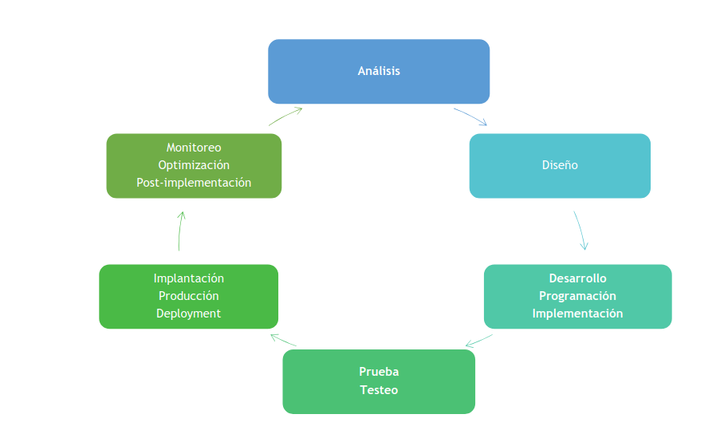
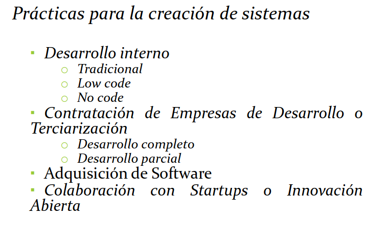

# Creacion de sistemas en las orgnizaciones

- Desarrollo Interno
- Contratacion de empresas de Desarrollo o Terceriacion
- Adiquisicion de Licensias de Software
- Colabaracion con Startups o innovacion abierta

## Desarrollo Interno:

### Variantes
- Tradicional
- ***Plataformas de desarrollo***:
  - low-code: simplifican el proceso de desarrollo al proporcionar componentes predefinidos y herramientas visuales. Esto acelera el desarrollo y permite a personas con menos experiencia técnica participar en la creación de sistemas (OutSystem, Mendix, Appian, etc...)
  - no-code: permiten a usuarios sin conocimientos de programacion crear aplicaciones y sistemas mediante la configuracion en lugar de escribir códogo.

### Caracteristicas de plataformas low/no-code:

- Visualizacion y diseño intuitivo: suelen ofrecer interfaces de usuario visuales y simplificadas que permiten a los usuarios diseñar la apariencia y funcionalidad.
- Automatizacion de flujos de trabajo: permiten la creación de flujos de trabajo automatizados y lógica de negocio mediante configuración en lugar de programación manual.
- Desarrollo rápido: Al eliminar gran parte de la codificacion manual, el desarrollo de aplicaciones puede ser mucho más rápido en comparacion con el desarrollo tradicional.
- Accesibilidad: Las plataformas no-code son especialmente accesible para personas sin experiencia en programación, lo que amplía la capacidad de crear soluciones personalizadas en una organizacion.

## Contratacion de empresas de desarrollo tercerizado o terciarización (outsiurcing)

Contratar desarrolladores de software independientes o empresas de desarrollo para crear sistemas personalizados según las especificaciones de la organización. Esto puede ser beneficioso cuando no se dispone de un equipo interno. Puede ser un desarrollo total o parcial.

- Especificaciones Detalladas: la organizacion debe proporcionar especificaciones detalladas del proyecto, que incluyan requisitos funcionales y no funcionales, objetivos, plazos y presupuesto. Cuanto más claro sea el alcance, más preciso será el trabajo de los desarrolladores contratados.
- Seleccion de Proveedores: la organización puede optar por contratar a desarrolladores individuales, equipos de desarrollo o firmas. La eleccion dependera de la magnitud del proyecto y de los recursos disponibles.
- Gestión del Proyecto: la organización debe asignar un equipo de gestión de proyectos que supervise el progreso y la calidad del trabajo de los desarrolladores contratados. En el caso de la tercerización, la gestión del proyecto es de la empresa que contratamos para el desarrollo. La comunicacion afectiva es clave para asegurar que se cumplan los objetivos.
- Control de calidad: Es importante establecer estándares de calidad y realizar pruebas rigurosas para garantizar que la solución entregada cumpla con los requisitos y expectativas de la organizacion.
- Contratos y acuerdos de servicio: se deben establecer contratos y acuerdos de servicios detallados que definen los entregables, plazos, costos y otros términos clave.

## Adquisicion de licencias de software:

Implica la compra de las mismas con el software ya listas para usar:

- Evaluación de Software: La organización debe investigar y evaluar diferentes soluciones disponibles en el mercado para encontrar la que mejor se adapte a sus necesidades especificas de la organización. Esto puede incluir configuraciones, intengración con otros sistemas y desarrollo de complementos personalizados.

- Personalizacion: A menudo, el software empresarial se personaliza para adaptarse a las necesidades especificas de la organizacion. Esto puede incluir configuraciones, integracion con otros sistemas y desarrollo de complementos personalizados.

- Actualizaciones y Soporte: Es importante tener en cuenta las actualizaciones y el soporte proporcionados por el proveedor de software. Las actualizaciones regulares son escenciales para mantener la seguridad y la funcionalidad.

## Colaboracion con Startups o innovacion abierta:

Las organizaciones pueden colaborar con startups o participar en programas de innovación abierta para desarrollar sistemas innovadores y soluciones tecnológicas.

- Selección de colaboradores: la organización debe identificar startups o socios que tengan experiencia o teconologia relevante para el proyecto. Esto puede requerir establecer asociaciones o participar en programas de innovación abierta.
- Co-creacion y experimentacion: La colaboracion a menudo implica un enfoque de co-creacion, dónde la organización y los colaboradores trabajan juntos en la definición y desarrollo de soluciones. Esto puede incluir la realización de experimentos y prototipos.
- Gestion de riesgos: La innovacion a menudo conlleva riesgos, por lo que es importante tener estrategias de gestión de riesgos en su lugar y estar dispuesto a aprender de los fracasos en el proceo de innovacion.

<!-- ctrl + flechas
      ctrl + d
      ctrl + shift + a -->

