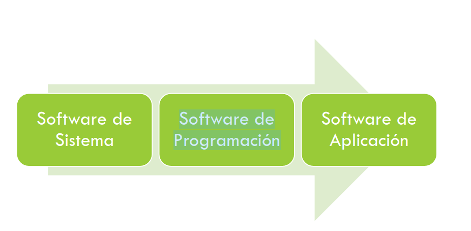
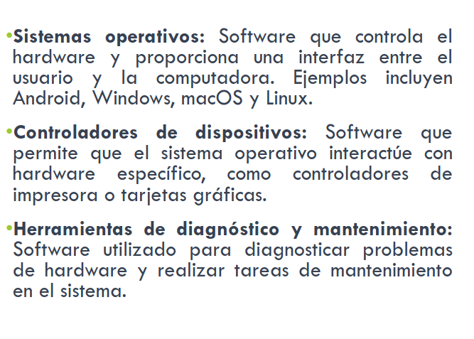
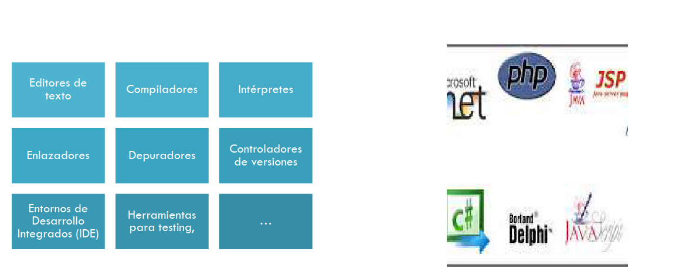
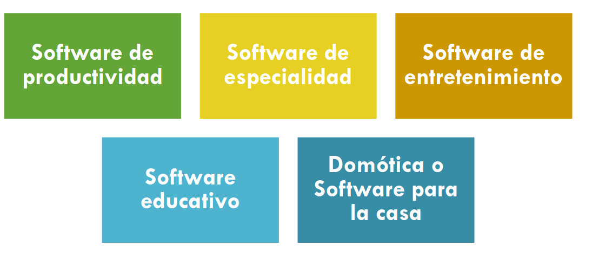
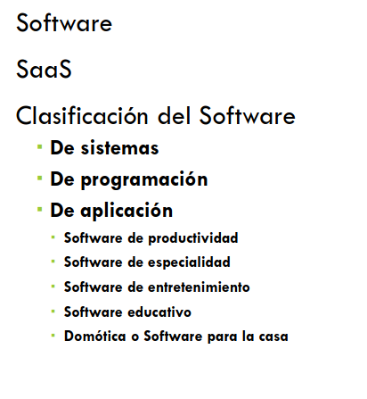

# Clase 7

## Software:
es la parte no-física que hace referencia a un programa incluye datos, reglas e instrucciones para poder comunicarse con la computadora y que **hacen posible su funcionamiento.**

Sin este las máquinas serian inutiles, y es desarrollado mediante el uso de distintos **lenguajes de programación**.

## ¿Producto o servicio?

El software como servicio permite a los usuarios conectarse a  aplicaciones basadas en la nube a través de internet y usarlas.

## SAAS

### Ventajas
- Menos inversion inicial y menor riesgo
- Reduccion de costos
- Actualizaciones y nuevas funcionalidades inmediatas.
- Soporte más agil y rápido.
- Centralizacion de los esfuerzos de la empresa en su negocio.

### Desventajas
- Nivel de confianza bajo en la seguridad de los datos.
- Intengración con el resto de las aplicaciones locales en la empresa.
- Necesidad de disponibilidad de los datos de las nube.
- Sensacion de cautividad del cliente.
- Posibl incumplimiento de los acuerdos sobre el nivel de servicio.

## Calificacion de software

### Software de sistemas:
- Su proposito general es servir a otros programas.
- Se relaciona directamente con el hardware y es empleado por diversos usuarios de forma cocurrente lo que requiere gestión de recursos y tiempos.
- Maneja estructuras complejas y variedad de interfaces externas.

### Software de programacion:

Representan al cojunto de programas que nos permiten desarrollar, crear y modificar otros programas, mediante este tipo de software se escribe el conjunto de instrucciones en un lenguaje determinado el cual se lo conoce como código del programa.

### Software de aplicacion:

Es ese software que hace que la computadora coolabore con el usuario en la realizacion de tareas tipicamente humanas.

### Software de productividad
Se basa en programas que nos ayudan a tener un mejor rendimiento y eficacia en nuestras tareas día a día. Dentro de las más comúnes podemos encontrar programas para finanzas personales, agendas, y en algunas empresas.

### Software de especialidad:

Este se basa principalmente en programas hechos a la medida para diferentes profesiones. Podemos encontrar programas para contadores, arquitectos, medicina, administradores, ingenieros, biólogos, etc.

### de entretenimiento

Este software es principalmente el que se utiliza para una infinidad de juegos basados en la plataforma de la computadora. 

### SOFTWARE EDUCATIVO 
destinado a la enseñanza y el aprendizaje autónomo.

### DOMÓTICA O SOFTWARE PARA LA CASA

se basa principalmente en programas que nos llevan a automatizar ciertos elementos dentro del hogar.

- Las tendencias en este tipo de software vienen de la mano de Internet de las cosas (IoT).

