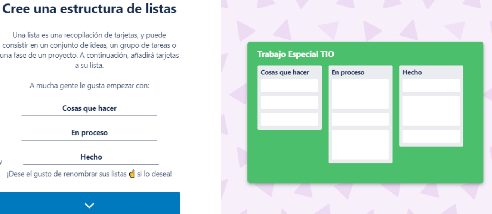

## Herramientas de trabajo colaborativo

### herramientas de colaboracion (categorías)

### Calificacion según espacio-tiempo

- Mismo lugar (colocados), mismo tiempo (sincronicos):  Interacciones cara a cara. 

- Diferente tiempo(asincronicas), mismo lugar: tareas continuas. 
- Mismo timepo, distinto lugar(remoto): interraciones remotas.
  - Ejemplo: videoconferencia.
- Diferente tiempo, disitnto lugar: Comunicacion y coordinacion.
  - ej: correo electronico
  
### Recursos para trabajar de forma colaborativa:

- Entornos de trabajo
- Recursos para comunicarse, debatir y colaborar.
- Herramientas para compartir archivos
- Recursos para organizar el trabajo

### Administracion colaborativa del proyecto:
Los proyectos necesitan la coordinacion entre los diferentes equipos y los clientes para desarrollar cualquier producto
- Coordinacion y versionado de código -> git
- Coordinacion de requerimientos, necesidades del cliente, correcion de errores, etc -> Trello.

## Trello

### Gestion colaborativa de proyectos

*Trello es una herramienta de Software*:
- Es una plataforma que se extiende y adapta a el proceso de desarrollo de la empresa
- Sirve para la cooperacion y colaboracion del equipo.
- Con trello es posible priorizar, asignar, realizar  un seguimiento y reportar *Cards* de un proyecto.
- Es una herramienta de uso comercial con opciones gratuitas.

### Estructura de las listas de las cards:

### Tableros

- Un tablero es una entidad en Trello
- Es una coleccion de tarjetas
- Cada tablero tiene un nombre

### Vista de un tablero

### Tarjetas
- Es la unidad de trabajo que utiliza trello para realizar una mejora en el software que se está desarrollando.
- Si bien no tienen etiquetas por defecto, podemos crearlas según la metodologia de desarrollo que estemos usando, por ejemplo para SCRUM se usa:
  - Arreglo de un fallo
  - Requerimiento solicitado por el cliente
  - Pedido de documentacion especifico
  - Cualquier otra solicitud al equipo de desarrollo
  

### etiquetas tipicas de tarjetas:
● Epic
● Story
● Bug
● Improvement
● Task
● New Feature
● Risk

### Listas:

- Permite gestionar el estado de las tarjetas a través de estructuras de listas.
- Estas estructuras son editables. Por ende presentan mucha flexibilidad a la hora de definir los procesos y estados por los que pueden pasar una tarjeta.

### Añadir miembros

## draw.io

Es una herramienta de diagramacion muy flexible. Permite crear:

- Diagramas de flujo
- Diagramas de proceso
- Organigramas
- Diagramas UML
- Diagramas ER
- Diagramas de red
- y más...

