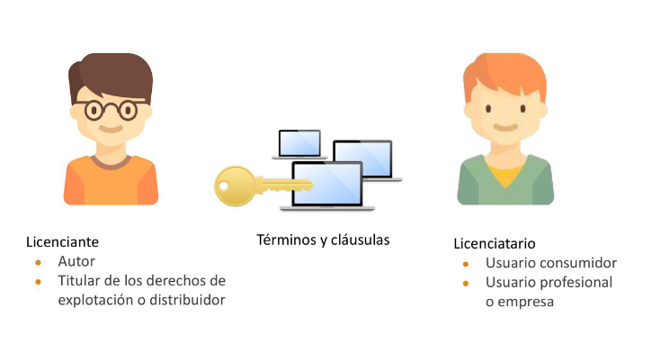
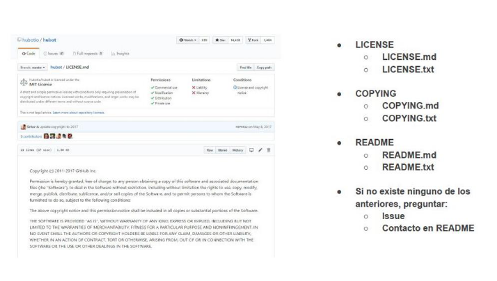
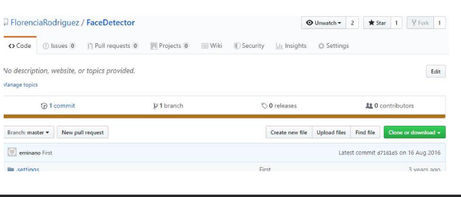
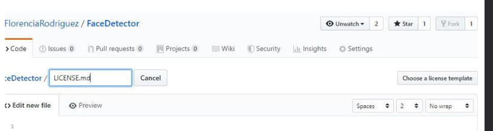
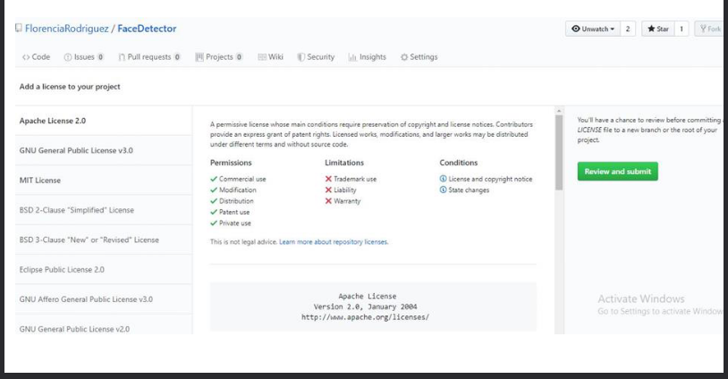
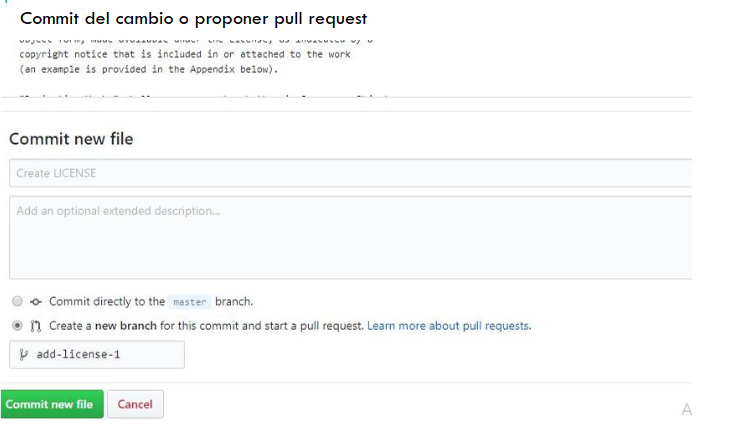

## Licensias de Software

### ¿Por qué se licencia el software?

- Fines comerciales
  - El software no se "vende", se "licencia"
  - Obtener un redito ecónomico
- Fines no-comerciales
  - Para limitar o restringir la forma de uso, módificacion y ditribución
  - Para proteger la propiedad intelectual
  - Para desligarse de implicaciones legales

### Patente vs licencia

> Conjunto de derechos exclusivos garantizados por un gobierno o autoridad al inventor de un nuevo producto susceptible de ser explotado industrialmente para el bien del solicitante por un periodo de tiempo limitado.

- Patente
  - Derecho de autor (reestrictivo)
  - Impide a otros explotar comercialmente una invención patentada
  - Protege al inventor
- Licencia
  - Consesion de derechos
  - Cotrato que permite conceder derehos entre autor y usuario
  - Una patente se puede licenciar

> básicamente, una patente se "posee" y una licencia se "alquila"

### Patente de software

Se consideran como "expresion de una idea", por lo que está bajo eñ regimen de derecho de autor. Los programas de computación no son
considerados invenciones.
Sin embargo, los programas de computación pueden ser patentables si
poseen un efecto técnico.

### software propietario y software libre

#### Propietario
No existe una forma libre de acceso a su código fuente, el cual solo se encuntra a disposicion de su desarrollador y no se permite su libre modificacion, adaptación o incluso lectura por parte de terceros.

#### libre

Proporciona la libertad de ejecutar el programa para cualquier proposito. Estudiar el funcionamiento del programa y adaptarlo a sus necesidades.
- Redistribuir copias.
- Mejorar el programa y poner estas mejoras a disposicion del público, para beneficio de toda la comunidad.

### Código abierto

- hablar de Open Source es hablar de software libre, pero de forma amigable a las empresas.
- No plantea cuestiones éticas
-  La organización dedicada al código abierto es la Open Source Initiative (OSI)

#### Premisas

1. Libre redistribución.
2. El código fuente debe estar incluido u obtenerse libremente.
3. La redistribución de modificaciones debe estar permitida.
4. Las licencias pueden requerir que las modificaciones sean re distribuidas sólo como parches.
5. Sin discriminación de personas o grupos.
6. Sin discriminación de áreas de iniciativa.
7. Deben aplicarse los mismos derechos a todo el que reciba el programa.
8. La licencia no debe ser específica de un producto.
9. La licencia no debe restringir otro software.
10. La licencia debe ser tecnológicamente neutral: no debe requerirse la aceptación de la licencia por medio de un acceso por clic de ratón o similar

### CopyRight y CopyLeft

> Conjunto de derechos exclusivos garantizados por un gobierno o autoridad al inventor de un nuevo producto susceptible de ser explotado industrialmente para el bien del solicitante por un periodo de tiempo limitado

#### copyrigth
- Derecho legal sobre el software
- Protege al autor del software sobre los derechos de copia, modificación y distribución no autorizada.

#### copyleft
- Restricción sobre licencias OS
- Permite la copia, modificacion y distribucion con la condicion de que se mantenga libre
- Protege al software libre de convertirse en privativo propagando el mismo tipo de licencias
- licencias virales

## Tipos de licenciamiento

➔ Licencia propietaria

➔ Shareware

➔ Freeware

➔ Software libre

### Licencias de Micosoft

>Microsoft utiliza una variedad de licencias para sus productos de software. ***Algunos de sus productos pueden ser propietarios y requieren una licencia de usuario final***, mientras que otros, como .NET Core, han adoptado licencias de código abierto. ***Un ejemplo de una licencia de código abierto utilizada por Microsoft es la Licencia MIT*** (anteriormente conocida como Licencia MS-PL), que se aplica a proyectos como .NET Core. Esta licencia permite un uso amplio y no impone restricciones significativas.

### Licencias FSF 1/2 

>**MIT**. La Licencia MIT es una ***licencia de software de código abierto muy permisiva***. Permite a los usuarios utilizar, modificar, distribuir y redistribuir el software sin muchas restricciones. Se caracteriza por su simplicidad y claridad. A diferencia de la GPL, ***la MIT License no requiere que las obras derivadas se distribuyan bajo los mismos términos***, lo que la hace más flexible en términos de integración con otros proyectos.

### Licencias FSF 2/2

>***GPL***. Su objetivo principal es promover el software libre y ***garantizar que el código fuente de un programa esté siempre disponible para cualquier persona*** que lo utilice. La GPL establece que ***cualquier software derivado de un programa con licencia GPL también debe ser distribuido bajo los términos*** de la GPL (copyleft) y garantiza que las mejoras y modificaciones realizadas en el software de código abierto sigan siendo de código abierto

### LICENCIA DE OSI

> ➔ **ZPL**. Es una licencia de código abierto ***usada primordialmente para el software de servidores de Zope***. ***Permite el uso del código fuente en software no libre e Incluye clausulas prohibiendo su uso comercial*** y requiere la documentación de todos los cambios al software.

> ➔ OBPL. ***El código de la versión no se publica*** ni está íntegramente bajo esa licencia, sino que ***hay partes con licencias privativas diversas***.

### LICENCIAS COMPATIBLES Y CONFLICTIVAS

> Las licencias de software **pueden ser compatibles o conflictivas en función de cómo se combinan y se aplican** en un proyecto o producto de software. Combinación: Por ejemplo, se puede **combinar código con licencia MIT y código con licencia Apache 2.0 en un mismo proyecto, ya que ambas licencias son compatibles**. Jerarquías: Por ejemplo, la licencia GPL establece que cualquier software derivado de un programa con licencia GPL también debe ser distribuido bajo los términos de la GPL, incluso si se combina con componentes bajo otras licencias. Conflictos de Copyleft. Por ejemplo, mezclar GPL y MIT. Incompatibilidad funcional. Por ejemplo, utilizar un componente con licencia propietaria y un componente con licencia GPL en el mismo desarrollo

## reflexiones

### ¿Cómo sé cuál es la licencia de un proyecto os?

### ¿Como definimos una licencia?

1. Seleccionar la licencia más apropiada (choosealicense.com)
2. Homepage de nuestro proyecto -> “Create new file”
3. Nombre LICENSE o LICENSE.md
4. Se habilita botón “Choose a license template”

### ¿Como defino una licencia? 2

### ¿CÓMO DEFINO UNA LICENCIA? (3)

5. Elegir plantilla de licencia

### LICENCIAS EN NUEVOS REPOSITORIOS DE GITHUB

- El license picker sólo está disponible en repositorios nuevos.
- Para repositorios existentes, se usa el procedimiento anterior.

